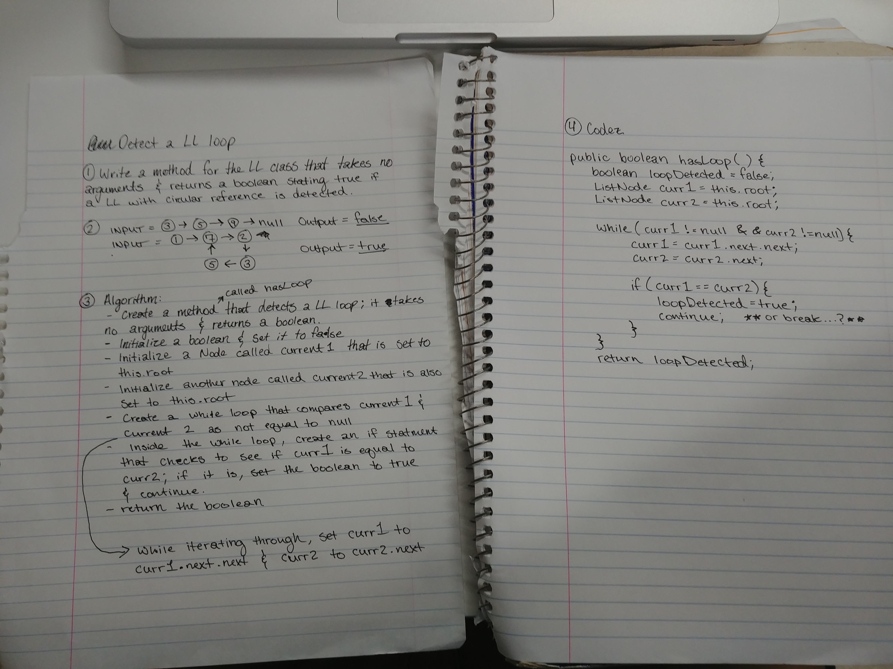

# Linked List loop detection

- Check to see if a linked list has circular reference (a loop).

## Challenge

- Create a method that accepts no arguments and returns a boolean
- If a circular reference is detected, return true, otherwise return false
- Make sure that the method doesn't break if it is applied to a list without a loop in it.

## solution

