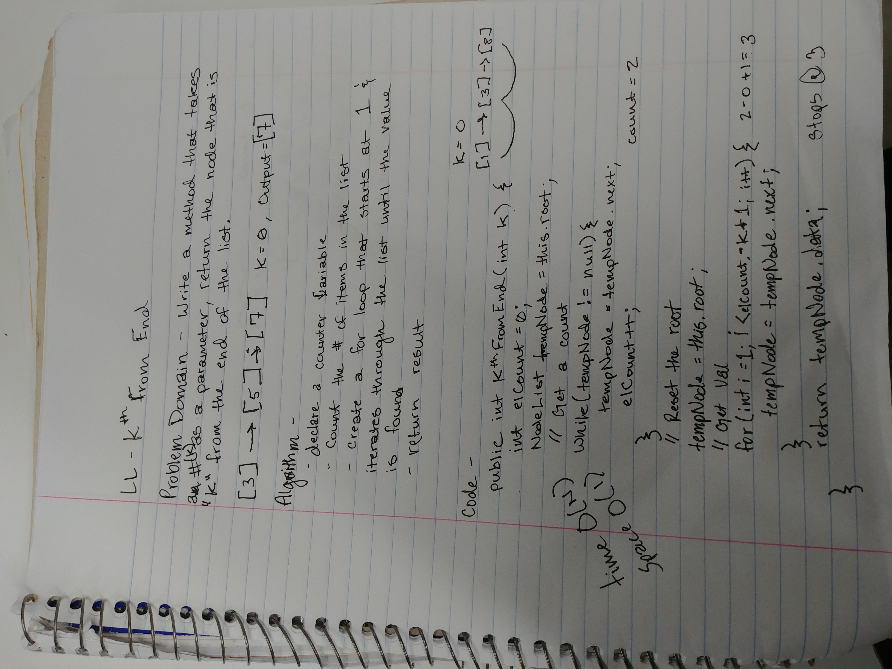

# Kth from the end of a linked list

- Given a linked list
- Methods created in the LinkedList class can be used.

## Challenge

- Write a function for the linked list class that will accept a number (k) as a parameter and return the node from the index of k (the index starts at the end of the list).

## Solution

- **To refactor, instead of using the while loop to count the amount of items in the list, the size() method could have been used instead.

