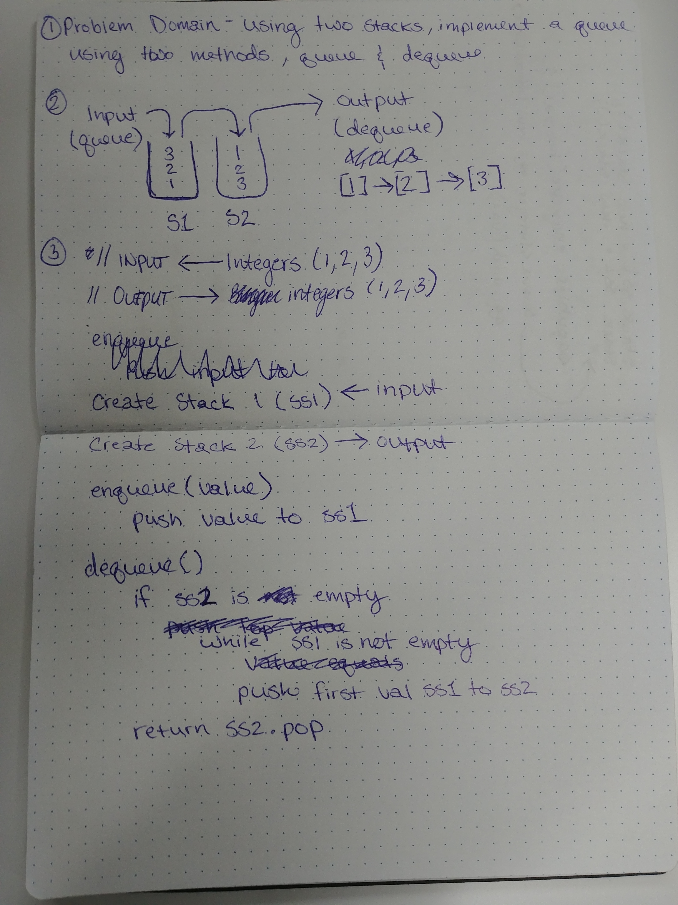

# Queue with stacks

- Implement a queue using two stacks

## Challenge

- You have access to two stacks with push and pop methods
- Write two methods for the Queue class (enqueue and dequeue) that add values to the queue utilizing the first in, first out approach

## Solution

