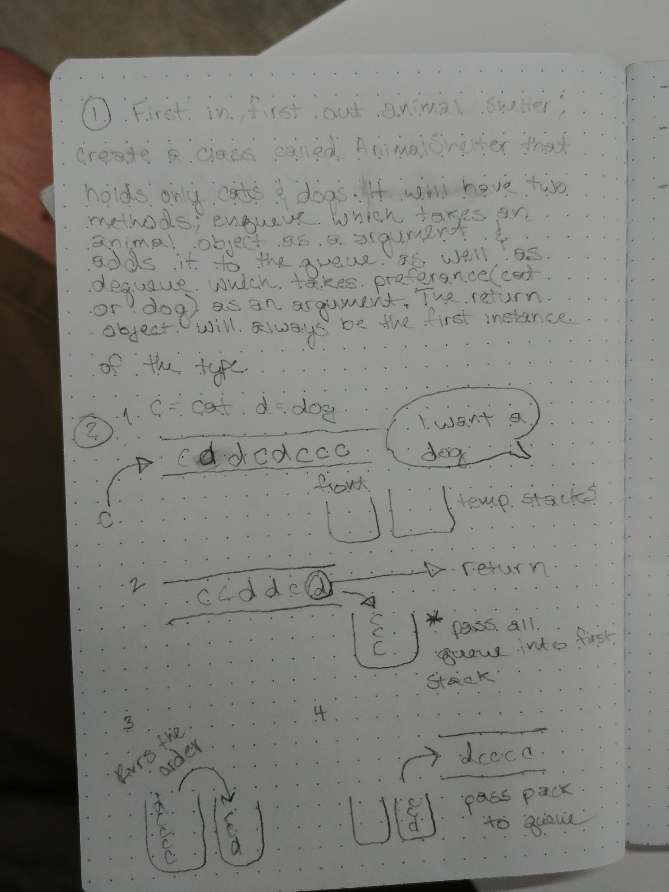

# First in, First out Animal Shelter

- Create a class that holds cats and dogs and returns them utilizing the first in, first out methodology.

## Challenge

- The shelter holds only cats and dogs
- Store animals in a queue 
- Create two methods, one that adds animals to the queue and one that pops an animal off the queue depending on what type is passed in as a parameter

## Solution

*** I ended using a totally different solution, that's why this whiteboard isn't complete ***

