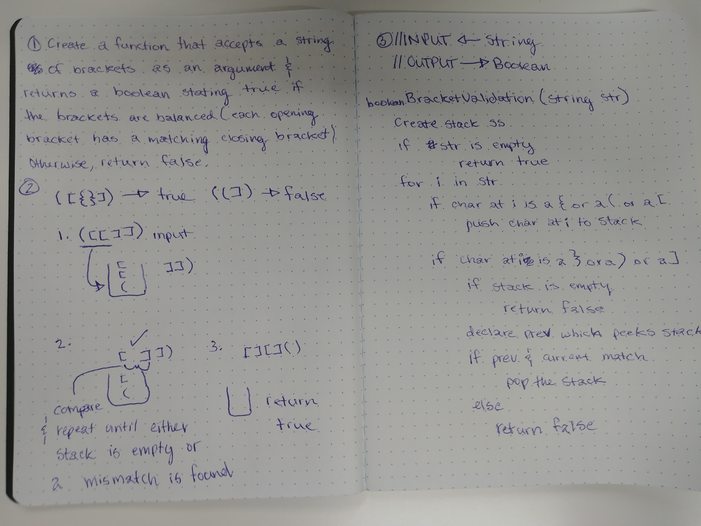

# Multi bracket validation

- Check a string of brackets to see if it's balanced or not.

## Challenge

- Write a method that checks a string of brackets (square, curly, and parens) to see if it is balanced or not (each opening bracket has a matching closing bracket).
- If the string is balanced, return true, if it is not, return false.

## Solution

