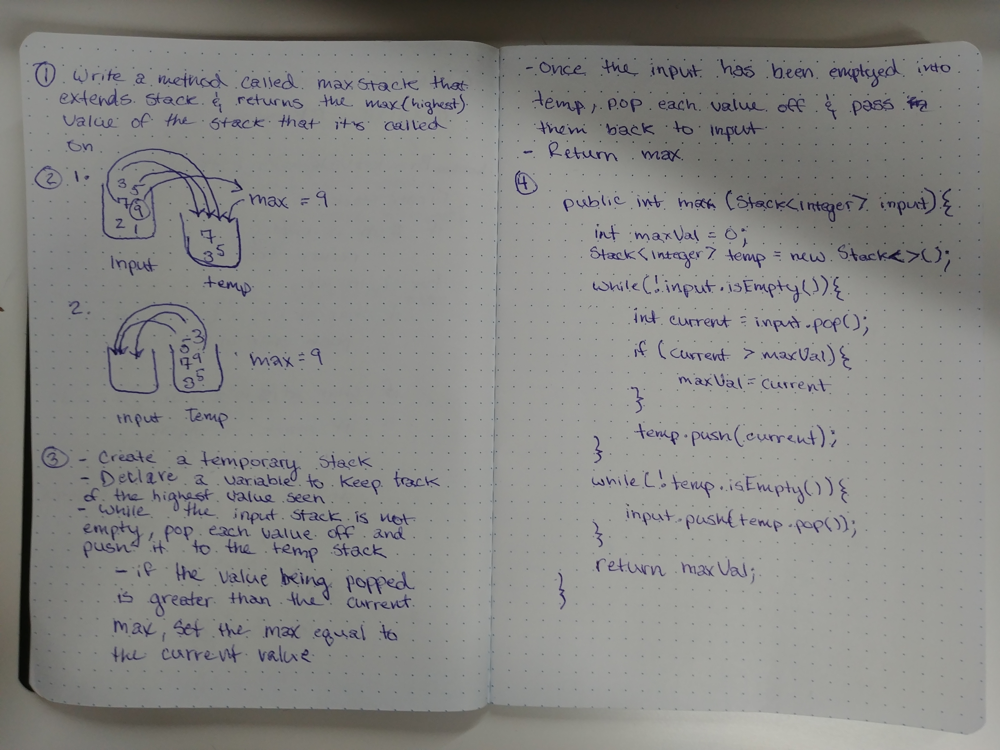

# Max Stack

- Create a class called MaxStack that extends off of Stack and contains a method that determines the highest value in the stack.

## Challenge

- Extend off the class Stack
- Determine the highest value in the stack that the method is called on without altering it's order.
- Make sure the max method works even when the stack has been updated (a value has been added or popped off)

## Solution

