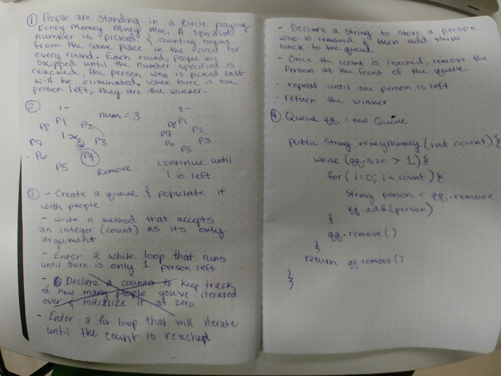

# Eeney Meeney Miney Moe

- People are standing in a circle playing eeney meeney miney moe. The counting starts at the same place everytime and the count will be the same for each round. During each round, you will move around the circle skipping each person until the specified count is reached, the person the count stops on will be removed. Repeat this process until there is only one man left standing, he is the winner.

## Challenge

- This problem can be solved using a queue; the ideal solution will enqueue and dequeue ```n``` number of times, once ```n``` is reached, the value at the front of the queue will be removed.
- The solution should be O(n) for time and O(1) for space.

## Solution

