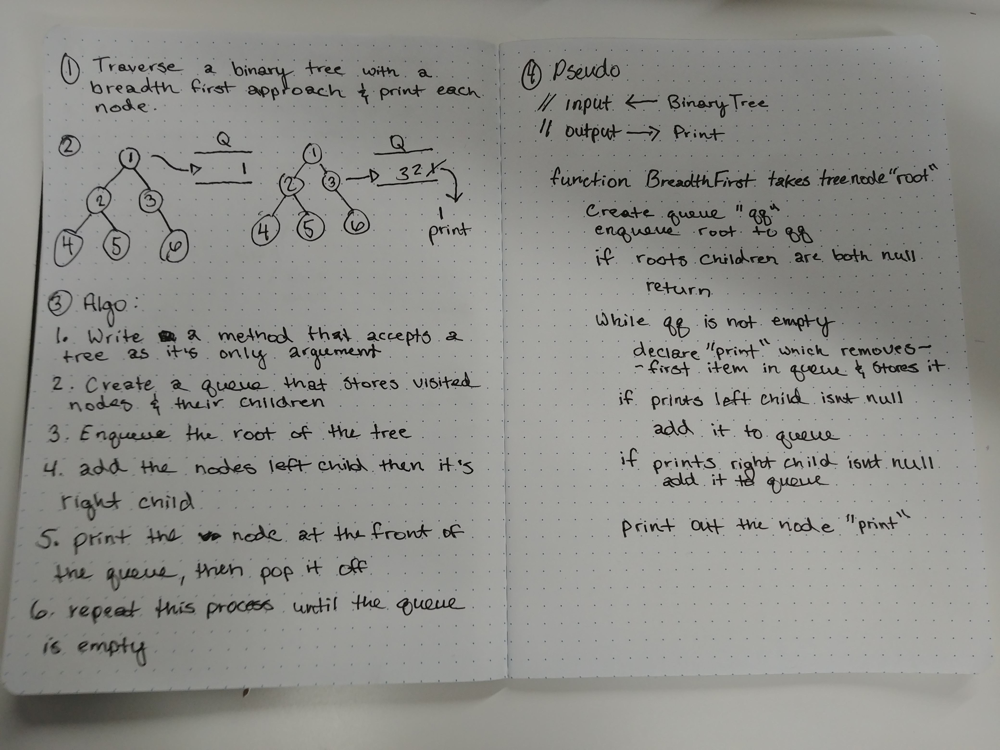

# Breadth first traversal

- Traverse a binary tree in a breadth first approach printing out each node as they are visited

## Challenge

- Write a function called breadthFirstTraversal that accepts a binary tree as it's argument
- Traverse the tree and print out each node row by row from left to right

## Solution

