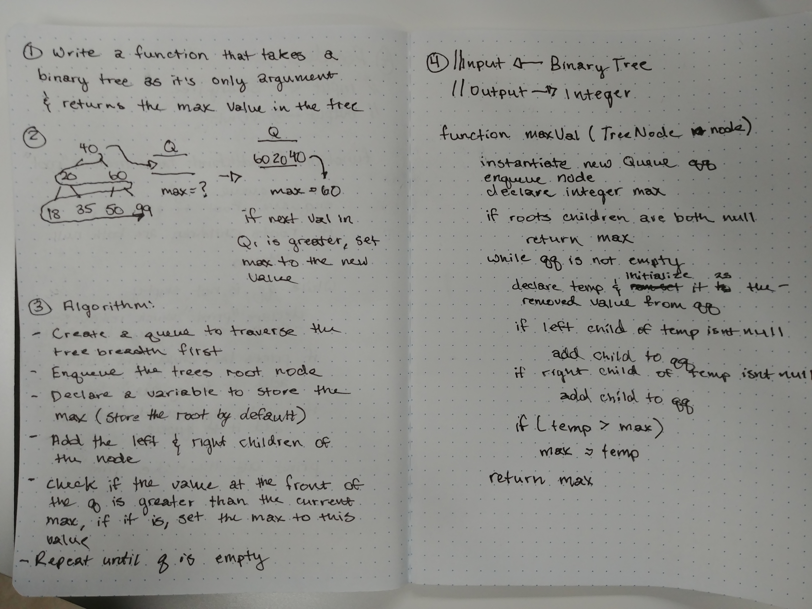

# Find Max Value

- Traverse a binary tree and find it's maximum value

## Challenge

- Write a function that takes a binary tree as it's only argument
- Traverse the tree searching for it's highest value node and return the data from it

## Solution

