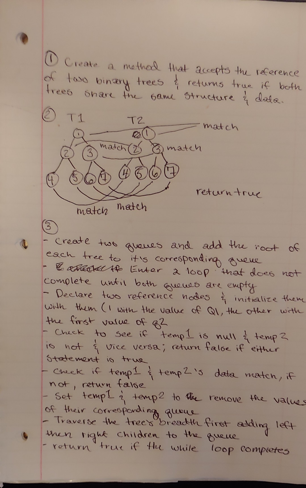

# Identical Binary Trees

- Check to see if two binary trees share the same data and structure

## Challenge

- Create a method that accepts the reference to two binary trees
- Traverse both trees and check to see if both trees have the same structure as well as data
- If they are identical, return true, otherwise return false

## Solution

