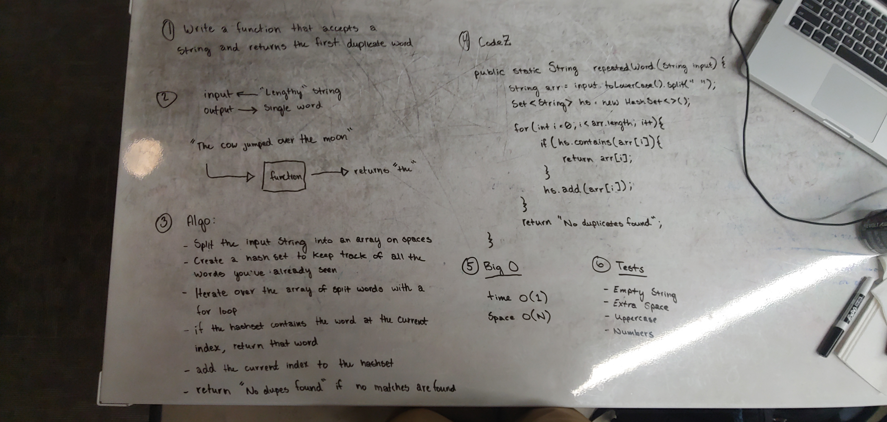

# Repeated Word

- Find the first duplicated word in a string and return it

## Challenge

- Write a method that accepts a "lengthy" string as an argument and returns the first word that is duplicated in the string.
- Be sure to account for extra spaces, numbers, and single letters.

## Solution

