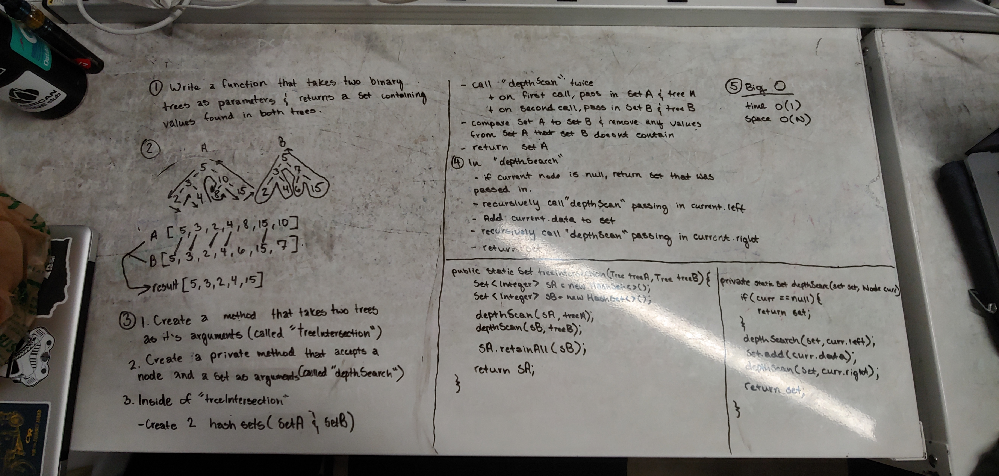

# Tree Intersection

- Find the common values shared by two binary trees

## Challenge

- Write a method that accepts two binary trees as it's parameters and returns a set containing the common values shared between the two trees.
 
## Solution

