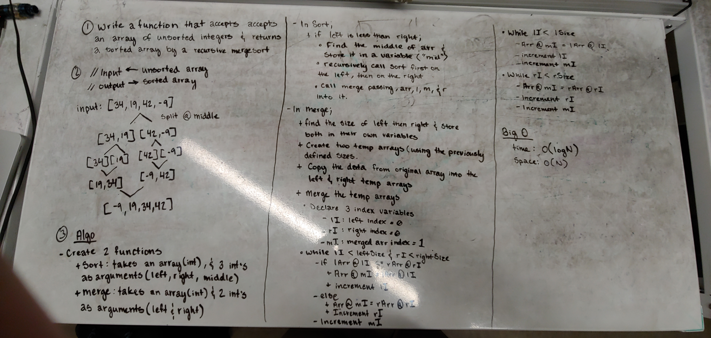

# Merge Sort

- implement a method that will sort an array using the merge sort approach

## Challenge

- Write a function that accepts an array of unsorted integers and returns a sorted array
- Use a recursive merge sort approach to implement this method

## Solution

