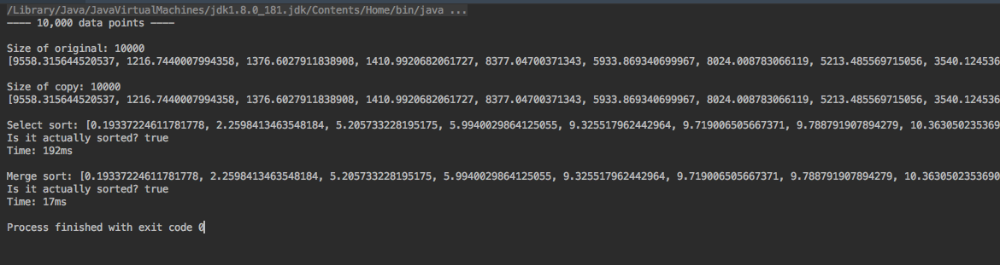
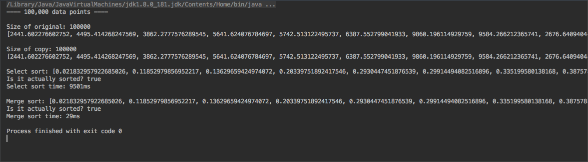
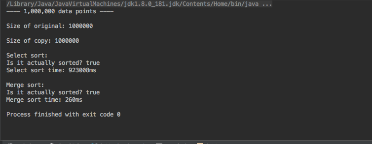

# Compare Select Sort & Merge Sort Times

- Given arrays of random data, sort them using select sort and merge sort keeping track of how long each algorithm takes to sort the same array.

## Challenge

- Write a function called "randomN" that generates an array of size N filled with random double numbers. Write another function called "copy" that takes an array and produces and exact copy. Write a program that times out how long it takes to sort an array. Sort arrays of the following sizes:

    - 10,000

    - 100,000

    - 10,000,000 (or whatever your computer can support if this is impossible on your machine)

- Write a program that generates a random array of those sizes, copies the array so there's two copies, and then sort the array with two sorting algorithms: SelectionSort and Merge Sort. Time how long they take to look and record the results in a README.md file.

## Times

